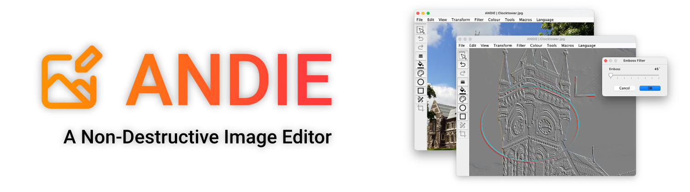
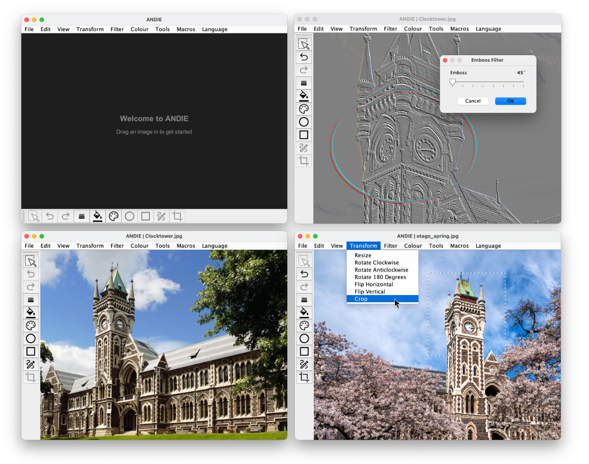
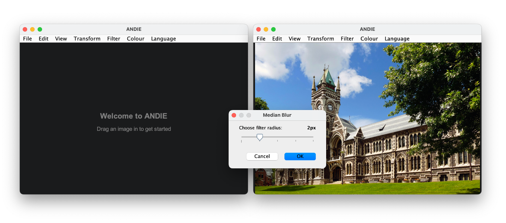

# __Andie Image Editor__ : Group M

## Download [ANDIE.jar](https://cosc202-m.cspages.otago.ac.nz/andie/Andie.jar)

---

## User guide 

__Welcome to ANDIE__

To get started with ANDIE, drag and drop an image that you'd like to edit, or open an image by going to `File` > `Open`.

Use scrolling and the shift key to pan around the image, or if you're using a trackpad, you can use two-finger panning. You can zoom in and out by holding `CTRL` and scrolling.

Image operations like filters, colour adjustments, and transformations can be applied to your image, by clicking them in the menu bar. You can undo and redo operations by clicking the corosponding buttons in the toolbar, or by using `CTRL`+`Z` and `CTRL`+`Y`.

You can draw shapes onto images in Andie by using the shapes tools. Click to select the line, rectangle or elipse tool in the toolbar, and drag to draw onto your image. You can hold `SHIFT` to have these shapes maintain their ratios, and `CTRL` to have them scale from the start of your drag.

To change the active fill color, stroke color, or stroke width, just click the corrosponding button in the toolbar.

Switch to the select tool to select regions of the image, also by dragging. Once a region has been selected, press the crop button to crop your image.

If you want to save a sequence of operations for later use, use the macros menu to record a macro, apply the desired operations, finish your recording, and save the resulting macro file to your computer. To reapply the recorded operations, use `Macros` > `Apply a Macro`.

Andie is a **Non-Destructive** image editor, so any operations you make will be stored alongside the image when you saved, and the image itself will be left untouched. If you want to export your modifications to a new image, use the export menu by going to `File` > `Export`. Select a format, and save your new image.

Change Andie's language by selecting `Language`

__A note about keyboard shortcuts: While the above guide mentions keyboard shortcuts involving `CTRL`, these shortcuts will instead be mapped to `COMMAND` if Andie is running on MacOS, as this is generally what Mac users would expect__

---
## Docs
JavaDocs can be found [here](https://cosc202-m.cspages.otago.ac.nz/andie/docs).

---
## Folder Structure

The workspace contains two folders, where:

- `src`: the folder to maintain sources
- `lib`: the folder to maintain dependencies

Within `src` there is:

- Our source code, under `cosc202/andie`
- The language bundles for the languages we support, under `languages`
- Our unit tests, under `tests/cosc202/andie`

Within `src/cosc202/andie` there is:

- The main class, `Andie.java`, and other supporting classes core to the operation of Andie.
- `actions`, containing the classes defining the "actions" Andie can perform. (displayed in the menu bar)
- `components`, containing custom reusable swing components.
- `operations`, containing grouped imageOperations to be used within actions.
- `tools`, containing different tools that can be activated and used on the image. 
- `models` containing the "business logic" of the program, including the `EditableImage` class, which stores the image and operations applied to it.
- `controllers` containing classes that glue the UI and models together, responsible for handling IO & Threading among other things.

---
## Testing
To test our program, we used a combination of Unit Testing, manual testing, and peer-reviewing.

After writing new code, we checked it's functionality by manually verifying its functionality, including testing it on a variety of edge-cases, for example:
- Transforming images with unusual dimensions (Very large, very small)
- Exporting images with transparency into formats that do not support transparency
- Opening images with unusual file extensions (e.g. .txt)
- Applying filters to images with unusual dimensions

We tested as a team, getting each other to run our code and try to break it.

We also used Unit Testing to further verify that the Transform operations specifically were performing as expected, given different image inputs.

In testing the filters, we had to verify that their output looked as expected. An example of how we tested our Median Filter was to apply it to a "salt and pepper" image, and verify that the noise was removed.

In our testing, we found one interesting quirk of how our operations were applied: In "palletised" `png` images, the limited color pallete is maintained by ANDIE, such that no colors not already in the images's pallete may be added. This leads to some unexpected results from filters, and unexpected hatching/dithering done by the Graphics2D API when approximating a custom color, while painting onto a png with a severely limited color pallete.

We've decided to leave this quirk in, rather than coerce images with limited color palletes into a different format while they are edited.

It did cause us some issues though; the "Line" shape in Andie is antialised, which did not play well with the limited color pallete of the image, leading to lines not functioning as expected. We fixed this by only enabling antialiasing when the image stores color with at least 5 bits.

## Changes from the original ANDIE
We've refactored ANDIE in a number of ways, to make it easier to work with, and to add new features. 

As detailed in **Folder Structure**, we've restructured the code to be more modular, putting actions, components, and operations into their own packages.

We've added new support classes, including `LanguageConfig.java` for handling the language bundles.
- `Andie.java` has been refactored such that the UI is created in a separate method, `setup()`. This allows the UI to be reloaded when the language changes, without having to restart the program and lose any unsaved changes.
- `ImagePanel.java` has been heavily modified, with the current image now drawn in the center of the panel, and the panel being zoomable by scroll. A welcome message and ability to drag and drop an image have also been added.
- `EditableImage.java` has been added to, with support for saving and exporting images, as well as being able to test if an image has been modified since it was last saved.
- `ImageAction.java` has had an `updateState()` method added, which is to be called when the menu item becomes visible. This allows actions to be disabled depending on the current state of the image.
- We added `MenuActions.java`, a new superclass of our actions, which handles the creation of JMenuItem's for the menu bar, using the list of actions, and handles calling `updateState()` when the menu item becomes visible.

---

## Who Did What (Second Deliverable)

### Bernard
- The Toolbar (*Defined within `AndieView`*)
- Code commenting
### Blake
- Emboss Filter
- Sobel Filter
### Oliver
- Helped with Emboss & Sobel filters
- Added further translations for new strings
- Code commenting
### Jeb
- Added operation live previewing (with threading)
- Macros
  - Including a Macros panel, showing a list of operations as they are recorded
  - Ability to record, save and load macros
- Shape operations
	- Line, Rectangle, Ellipse
- Added new `ImagePanView` for proper image panel zooming and panning 
- Added support for tools
	- Added Line, Rectangle, and Ellipse tools
- Select tool
  - Created an overlay system for overlaying graphics onto the panel, allowing for the select tool to be implemented
  - Created select tool with animation
- Crop operation
- Gitlab pipeline
---

## Who Did What (First Deliverable)
### Bernard
- Image transform operations
	- Flip (Horizontal, Vertical)
	- Resize
	- Rotate (90˚, -90˚, 180˚)
### Blake
- Image filter operations
	- Sharpen Filter
	- Gaussian Blur
	- Median Blur
### Oliver
- Image adjustment operations
	- Brightness
	- Contrast adjustment
- Translations
	- English, Maori, French, German, Spanish, Turkish, Italian
### Jeb
- File operations
	- Open, Save, Save As, Export
- Error handling (Error messages)
- Error avoidance
	- Disabling menu items that cannot be applied to the current image
	- Warning user when closing unsaved image
- Quality of life changes
	- Welcome screen
	- Drag and drop to open an image
	- Image filling the frame by default
	- Ctrl+Scroll to zoom
	- Sliders for image filters/adjustments
- Language support
	- Loading correct messageBundle, fallback language
	- Restarting the UI when language changes